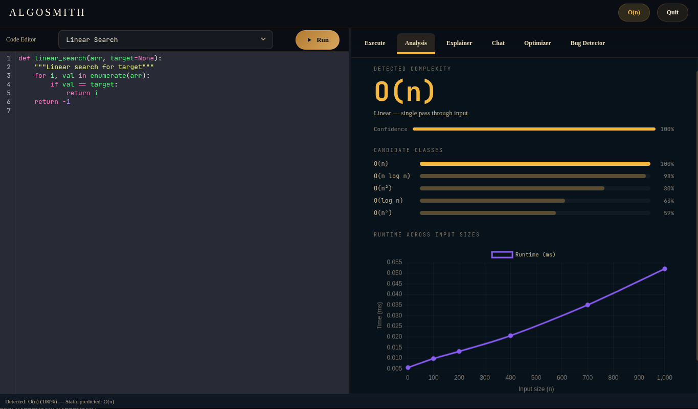

<div align="center">
  

  <p>Write any Python function. AlgoSmith runs it, measures it, and tells you exactly how it scales.</p>

</div>

---

## What it does

AlgoSmith takes your Python function, runs it against a range of input sizes, and matches the timing data to a Big O class using curve fitting. It also does a static read of your code before running anything, so you get a prediction instantly and a measured result after.

The two results are compared. If they disagree, the AI tells you why.

---

## Features

### **Code Editor**
Full Python editor with syntax highlighting. Pick a built-in algorithm from the dropdown or write your own from scratch.

### **Analysis**
Detected complexity shown with a confidence score and a ranked list of all candidate classes. A runtime chart plots the actual measured times against input size.

### **Explainer**
A plain English breakdown of which parts of your code drive the complexity, and a concrete suggestion to improve it if one exists.

### **Optimizer**
Rewrites your function with better time complexity if possible. Runs only after the Bug Detector clears the code.

### **Bug Detector**
Scans your code for syntax errors, logic errors, infinite loops, and other common problems before any analysis runs.

### **Execute**
Run your function with a specific input and see the raw output. Good for checking your code works before running the full analysis.

### **Chat**
A built-in AI assistant for any questions about algorithms, complexity, or code.


<div align='center'>
  <h3>Analysis Screenshot </h3>
  
</div>

---

## How to Run

### Windows

```bash
git clone https://github.com/your-repo/AlgoSmith.git
cd AlgoSmith

python -m venv venv
venv\Scripts\activate

pip install -r requirements.txt
```

Create a `.env` file in the root folder:

```
OPENROUTER_API_KEY=your_key_here
MODEL_NAME=openai/gpt-oss-120b:free
MAX_TOKENS=2000
```

```bash
python main.py
```

---

### Linux

```bash
git clone https://github.com/your-repo/AlgoSmith.git
cd AlgoSmith

python3 -m venv venv
source venv/bin/activate

pip install -r requirements.txt
```

Create a `.env` file in the root folder:

```
OPENROUTER_API_KEY=your_key_here
MODEL_NAME=openai/gpt-oss-120b:free
MAX_TOKENS=2000
```

```bash
python3 main.py
```

> If the window does not open on Linux, make sure Chromium is installed: `sudo apt install chromium-browser`

---

## Team

<table align="center">
  <tr>
    <td align="center">
      <a href="https://github.com/FearThePLOTO">
        <br/>
        <sub>FearThePLOTO</sub>
      </a>
    </td>
    <td align="center">
      <a href="https://github.com/ahmed1842005">
        <br/>
        <sub>ahmed1842005</sub>
      </a>
    </td>
    <td align="center">
      <a href="https://github.com/mohamed-12-tarek">
        <br/>
        <sub>mohamed-12-tarek</sub>
      </a>
    </td>
    <td align="center">
      <a href="https://github.com/mahmoudtarek10">
        <br/>
        <sub>mahmoudtarek10</sub>
      </a>
    </td>
  </tr>
</table>

---

<div align="center">
  <h3>Your algorithm does not know what it is hiding. AlgoSmith does.</h3>
  
  <sub>Built for Algorithms Course CSE 2nd Year, Zagazig University, 2025/2026</sub>
</div>
